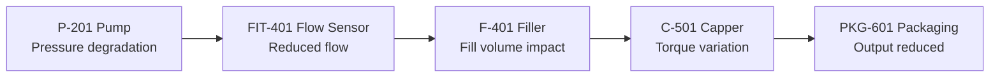
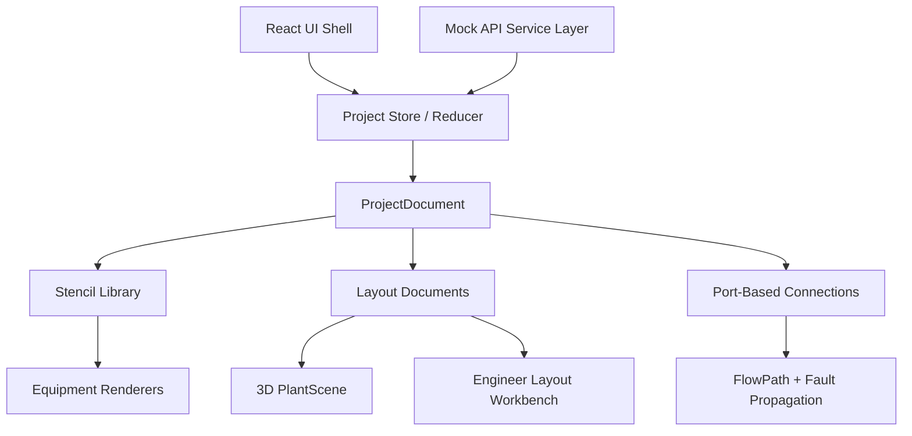

# PLANTLENS Process Studio

**A Google Maps-style industrial digital twin studio for process lines, fault propagation, and reusable factory equipment layouts.**

PLANTLENS Process Studio is a frontend digital twin prototype designed for an ABB Accelerator-style jury demo. It combines an operator-ready 3D plant map with an engineer-focused edit workspace where industrial components can be selected from a reusable stencil library, placed on layouts, connected, configured, and previewed in a synchronized 3D scene.

The goal is to make plant operations easier to understand at a glance: operators can see where a fault starts, how it propagates, which equipment is affected, and what action should be taken next.

## Product Vision

Industrial teams often switch between dashboards, alarm lists, engineering drawings, and maintenance notes. PLANTLENS brings those views together into one map-like interface:

- **Operators** see a clean plant overview, alarms, KPIs, fault paths, and recommended actions.
- **Maintenance teams** see equipment health, service impact, and action workflows.
- **Engineers** can create process layouts from a reusable equipment library.
- **Managers** get a KPI and RCA-oriented view of risk, downtime, and production impact.

## Key Capabilities

- **3D industrial process map** built with React Three Fiber and Three.js.
- **Reusable stencil library** for tanks, pumps, sensors, conveyors, fillers, cappers, packaging units, valves, motors, compressors, utilities, and Open Industry Project CAD assets.
- **Hover-based 3D catalog previews** for equipment library components.
- **Drag-and-drop layout editor** with snap-to-grid placement and collision-aware insertion.
- **Movable placed components** directly in the edit canvas.
- **Multiple process layout tabs** with create and delete support.
- **Operator/Edit mode separation** so the demo view stays clean while engineering tools remain available.
- **Role-based views** for Operator, Maintenance, Engineer, and Manager workflows.
- **Fault propagation visualization** from root-cause equipment through downstream assets.
- **Google Maps-style controls** including zoom, pan, rotate, reset, fit view, search, mini-map, and layers.
- **Compact Calm Card** for severity, confidence, root cause, RCA, maintenance ticketing, alarm acknowledgement, and history.

## Demo Scenario

The default Packaging Line shows a fault starting at **P-201 Pump**:



The system highlights:

- **Root cause:** P-201 Pump
- **Affected path:** FIT-401 -> F-401 -> C-501 -> PKG-601
- **Risk:** High downtime and reduced output
- **Recommended action:** Check suction line, filter blockage, and pump wear

## Interface Modes

### Operator Mode

Clean monitoring view for plant operators:

- 3D process map
- KPIs
- Calm Card
- selected equipment details
- fault path
- mini-map
- timeline drawer
- layers

### Edit Mode

Engineering workspace for plant layout configuration:

- stencil library
- active layout canvas
- drag-and-drop placement
- movable equipment cards
- process connections
- layout create/delete
- save layout
- preview as operator

## Role-Based Views

| Role | Focus |
| --- | --- |
| Operator View | Alarms, status, fault path, recommended action |
| Maintenance View | Health scores, tickets, service actions, notes |
| Engineer View | Stencils, layout editing, connections, configuration |
| Manager View | KPIs, production loss, downtime risk, incident/RCA summaries |

All roles use the same plant data. Only the visible panels and workflows change.

## Equipment Library

The component library is structured to support backend/database loading later. Current local stencils include:

- Tank
- Pump
- Flow Sensor
- Conveyor
- Filler
- Capper
- Packaging Unit
- Valve
- Motor
- Compressor
- Heat Exchanger
- Utility Supply
- Control Panel
- Generic Sensor
- Pipe Segment
- Open Industry Project CAD models

Each stencil can define:

- equipment family
- renderer
- default tag and label
- footprint
- input/output ports
- anchors
- editable parameters
- connection rules
- default live metrics

## Architecture



## Data Model

PLANTLENS uses a project-document approach inspired by Simulink libraries and AutoCAD blocks:

- `ProjectDocument` stores global project data.
- `StencilDefinition` stores reusable component metadata.
- `LayoutDocument` stores layout-specific nodes, routes, annotations, layers, and camera.
- `NodeInstance` stores placed equipment.
- `RouteInstance` stores structured connections between equipment ports.

This keeps new process layouts data-driven instead of hard-coded.

## Tech Stack

- **React 19**
- **Vite**
- **React Three Fiber**
- **Three.js**
- **@react-three/drei**
- **Lucide React**
- **CSS custom UI system**
- **Mock backend service layer**

## Local Development

Install dependencies:

```bash
npm install
```

Run the development server:

```bash
npm run dev
```

Build for production:

```bash
npm run build
```

Run lint checks:

```bash
npm run lint
```

## Project Structure

```text
src/
  components/
    PlantScene.jsx
    LayoutWorkbench.jsx
    ProjectToolbar.jsx
    CalmCard.jsx
    MapSidebar.jsx
    MiniMap.jsx
    TimelineRail.jsx
    symbols/
      EquipmentSymbols.jsx
      OpenIndustryAssetSymbol.jsx
      equipmentRegistry.js
  data/
    defaultConfig.js
    stencils.js
    openIndustryLibrary.js
    presentationModel.js
    projectValidation.js
  services/
    plantlensApi.js
  store/
    projectStore.jsx
```

## ABB Accelerator Demo Value

PLANTLENS demonstrates how industrial teams could use a visual digital twin to:

- reduce alarm interpretation time
- understand fault propagation without reading long alarm logs
- connect engineering layouts with operator workflows
- reuse industrial equipment libraries across layouts
- support RCA, maintenance, and management reporting from one plant model

In one sentence:

> **PLANTLENS is a map-like digital twin for factory process lines, helping teams design layouts, monitor assets, trace root causes, and understand operational impact visually.**

## Current Status

This is a frontend prototype with mock/API-ready services. It is ready for demonstration and can later be connected to:

- real equipment databases
- historian/time-series data
- CMMS maintenance systems
- alarm/event systems
- PLC/SCADA integrations
- simulation engines

## License and Assets

Open Industry Project model assets are kept under `public/open-industry/` with their included notice and license files.
